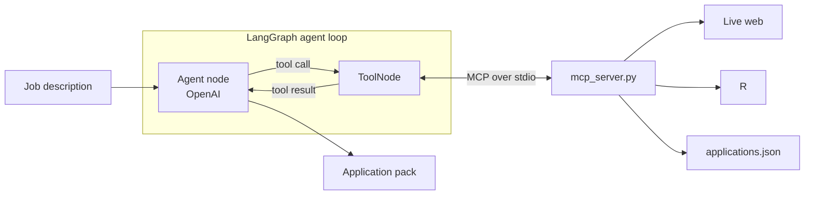

# Scout 🧭

> Paste a role. Scout researches the company, compares it with your resume,
> drafts an application and logs the result.

**RESEARCH → MATCH → DRAFT → TRACK**

Built live in **Agent Lab 01** with Python, LangGraph, the OpenAI API, MCP and
Streamlit. The graph is intentionally small enough to teach from the screen.

## See the agent



The model decides which tool it needs. LangGraph routes the decision. MCP
connects the graph to the outside world. The model never executes Python.

## Run the finished Scout

```bash
git clone https://github.com/NisargKadam/Job_Scout_v1.git
cd Job_Scout_v1

python -m venv .venv
source .venv/bin/activate
pip install -r requirements.txt
cp .env.example .env
```

Windows PowerShell activation:

```powershell
.venv\Scripts\Activate.ps1
```

Add an [OpenAI Platform API key](https://platform.openai.com/api-keys) to
`.env`:

```env
OPENAI_API_KEY=your-key-here
OPENAI_MODEL=gpt-4o-mini
```

Then start either interface:

```bash
python agent.py "Senior Python engineer at Acme"
streamlit run app.py
```

Open [http://localhost:8501](http://localhost:8501).

Python 3.11 or 3.12 is recommended.

> OpenAI API usage is billed separately from ChatGPT, and the default model has
> no free API tier. For a truly no-credit-card workshop, provide attendees with
> organizer-funded access or a controlled proxy; do not share one raw presenter
> key.

## Workshop checkpoints

Every branch runs. If your code breaks, jump to the instructor's checkpoint and
keep building.

| Branch | You have built |
| --- | --- |
| `step-1-first-call` | One OpenAI model call |
| `step-2-agent-loop` | The LangGraph agent ↔ tool loop |
| `step-3-mcp-server` | A real MCP server over stdio |
| `step-4-scout` | Research, resume matching, drafting and tracking |
| `step-5-deploy` | Streamlit plus deployment config |
| `main` | Tests, visual guide and final polish |

Catch up safely:

```bash
git stash push -u -m "workshop attempt"
git fetch origin
git switch -C my-scout origin/step-3-mcp-server
```

Replace `step-3-mcp-server` with the checkpoint announced on screen.

## The loop worth understanding

`agent.py` uses the same three moves until the model has a final answer:

```text
agent → choose a tool
tool  → return evidence
agent → continue or finish
```

In LangGraph, that becomes:

```python
graph.add_edge(START, "agent")
graph.add_conditional_edges("agent", tools_condition)
graph.add_edge("tools", "agent")
```

No prompt chain is pretending to be an agent. The next step is chosen at
runtime.

## Four MCP tools

| Tool | Boundary it crosses |
| --- | --- |
| `web_search(query)` | Finds live company sources |
| `fetch_url(url)` | Reads a public job or careers page |
| `get_resume()` | Loads `resume.md` |
| `save_application(...)` | Appends to `applications.json` |

Fit scoring and writing stay in the model's reasoning. They are judgments, not
external tools. That distinction is one of the central workshop lessons.

## Project map

```text
Job_Scout_v1/
├── agent.py             # explicit LangGraph loop
├── mcp_server.py        # four genuine MCP tools
├── app.py               # Streamlit UI
├── resume.md            # replace locally
├── applications.json    # application tracker
├── requirements.txt     # pinned workshop dependencies
├── .env.example         # safe configuration template
├── Procfile
├── railway.json
└── tests/               # keyless graph, MCP and UI checks
```

Use a sanitized resume during the workshop. Never commit your real phone
number, address, private history or `.env`.

## Add your own tool

Add one typed function to `mcp_server.py` and restart Scout:

```python
from datetime import date, timedelta


@mcp.tool()
def set_followup_reminder(company: str, days: int = 7) -> str:
    """Choose a date to follow up with a company."""
    due = date.today() + timedelta(days=days)
    return f"Follow up with {company} on {due:%d %b %Y}."
```

Try `estimate_salary_band`, `find_the_hiring_manager`,
`check_company_reviews` or `translate_jd`. The docstring tells the model when
the tool is useful.

## Verify before the workshop

The automated checks use a fake model and a local MCP subprocess, so they spend
no API credits:

```bash
python -m unittest discover -s tests -v
```

For one real end-to-end check:

```bash
python agent.py "AI engineer at a company you know"
```

Confirm that Scout cites live sources, uses the resume truthfully and writes
exactly one tracker record.

## Deploy

For Streamlit Community Cloud:

1. Select this repository, `main` and `app.py`.
2. Choose Python 3.11 or 3.12.
3. Add `OPENAI_API_KEY` and `OPENAI_MODEL` to app secrets.

For Railway:

1. Create a service from this repository.
2. Add the same two environment variables.
3. Generate a public domain.

`railway.json` supplies the start command and health check. Cloud filesystems
are ephemeral, so replace the JSON tracker with durable storage for production.

## Troubleshooting

| Symptom | Fix |
| --- | --- |
| `OPENAI_API_KEY is missing` | Copy `.env.example` to `.env` and add your key |
| `ModuleNotFoundError` | Activate `.venv`, then install `requirements.txt` |
| MCP server closes | Run from the repository root; do not print to MCP stdout |
| Scout skips a new tool | Improve its docstring and restart Scout |
| OpenAI returns `429` | Check project credits and rate limits, then retry |
| Search is rate-limited | Retry or paste the full job description |

## Production boundary

This is workshop code. A production version needs authenticated users, durable
and concurrent storage, tracing, budgets, retries, rate limits and approval
before external actions. `fetch_url` blocks local/private addresses and the
prompt treats web content as untrusted, but arbitrary web research is not a
complete security sandbox.


## How to switch to your own repo & push code

1. Create a new repo on GitHub
Go to github.com → New repository → name it → don't initialize with README (your code already exists locally).

2. Add the remote
`git remote add origin https://github.com/YOUR_USERNAME/YOUR_REPO_NAME.git`

3. Stage and commit (if you have uncommitted changes)
`git add .`
`git commit -m "Initial commit"`

4. Push
`git push -u origin main`
That's it. The -u flag sets origin/main as the default upstream so future pushes are just git push.

If your branch is still called master instead of main:

`git branch -M main   # rename it first`
`git push -u origin main`

## License

MIT

